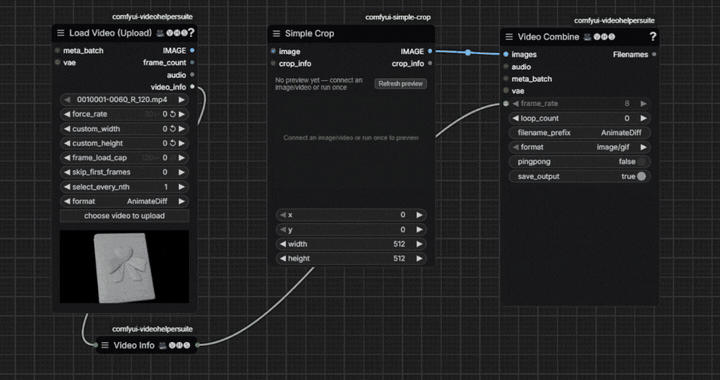
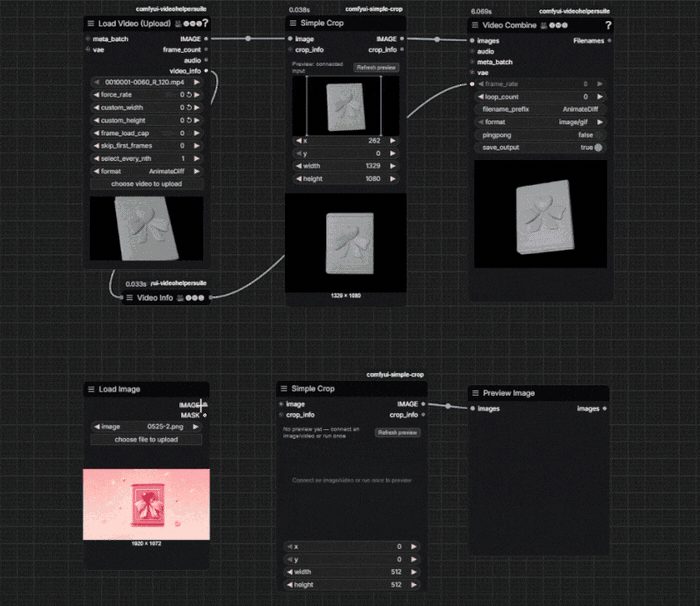

# ComfyUI Simple Crop

A crop node you operate by dragging a box on the node itself. `IMAGE` in,
`IMAGE` out — the same node handles a single image or a whole video frame
batch, because ComfyUI's `IMAGE` type is already a batch.

The preview appears as soon as you connect a source, so you can set the crop
without running the workflow first.

## Usage

1. Connect any `IMAGE` output into `Simple Crop`.
2. Drag the corners, edges, or inside of the box to set the region — or type
   exact `x` / `y` / `width` / `height` values below the preview.
3. Send the `IMAGE` output wherever you need it: `SaveImage`, VideoHelperSuite's
   `Video Combine`, an upscaler, a sampler, and so on.

After a run, the node's preview switches to the cropped result so you can check
the framing at a glance.

### Where this is useful

When you build a test pipeline around a reference video — layout, previs, a
render pass you're driving something with — the part you actually care about is
often a small region of the frame. Rendering layers separately, or feeding one
object to a model, usually means cropping in and scaling that object up so it
reads clearly.

Doing that in an editor means leaving ComfyUI, re-cutting, re-exporting, and
coming back every time the framing changes. This keeps it in the graph, and you
can see the crop while you set it.

### Keeping a still in sync with the video

A reference video is often paired with a separately rendered first frame. Both
need the same framing, or they don't describe the same shot.

Connect the video crop node's `crop_info` output into the still's `crop_info`
input. The second node then mirrors the first live, and its `x` / `y` /
`width` / `height` become read-only. Disconnect to edit it again.

The two sources rarely match in size — a 1920x1080 video next to a 1024x848
render is normal. The rectangle is transferred as a proportion and keeps its
aspect ratio, so both crops come out the same shape, positioned equivalently,
rather than reusing raw pixel numbers that would frame different regions.

An example graph covering both halves is in
[`example_workflow/`](example_workflow/SimpleCrop_demoWorkflow.json).

## Install

Copy (or clone) this folder into ComfyUI's `custom_nodes/`, then restart
ComfyUI. No extra Python dependencies.

## Notes

- **Video input:** VideoHelperSuite's `Load Video` is the smoothest pairing — it
  outputs `IMAGE` directly and carries its own live preview, so the crop box
  tracks the playing frame. ComfyUI's built-in `Load Video` outputs `VIDEO`
  instead, so it needs `Get Video Components` in between to reach `IMAGE`; that
  works too, and the preview falls back to a still frame from the source file.
- **Swapping a source file** on an upstream loader doesn't refresh the preview
  automatically — press **Refresh preview** on the crop node.
- **Odd output heights:** some decoders hand over codec-aligned frames (960x544
  for a 960x540 video). The node crops what it actually receives; after one run
  the preview re-syncs to that exact size so the box matches the real output.
- **Syncing is geometric, not content-aware.** It matches the rectangle, not the
  subject. If the two sources are framed differently to begin with (the object
  sits at a different scale in each), you'll still want to nudge one side. Core
  `Image Compare`, or `Image Blend` in `difference` mode, are handy for checking
  the result.
